# VisaEase 🌍

VisaEase is your trusted companion for hassle-free visa application management. Whether you're planning your first trip abroad or are a seasoned traveler, VisaEase simplifies the complex visa process with an intuitive platform designed to keep your journey stress-free and well-organized.

## 🚀 [Live Demo](https://visaease-bb42d.web.app/)

---

## 🌟 Key Features

### **User Authentication**

- Secure login and registration via **Email/Password** or **Google Sign-In**.
- Powered by **Firebase** for reliable and secure user management.

### **Dynamic Visa Management**

- Add Visa: A protected route to add visa details with forms and validation.
- Update/Delete: Edit or delete user-added visas with instant UI updates.
- View All Visas: A comprehensive list of all visas added by users.
- View Visa Details: Detailed information about each visa, including requirements and fees.
- Apply for Visa: A form to submit visa applications with real-time updates.
- View My Visas: A personalized page to manage user-added visas.
- View My Applications: A dedicated page to track visa applications.
- Search Visas: A search bar to find visas by country name or type.
- Sort Visas: Filter visas by visa type.
- Cancel Application: Cancel visa applications with a single click.

### **CRUD Operations**

- Real-time database updates using MongoDB for managing visas applications and users.
- Toast notifications or sweet alert for create, update, delete operations, sucess or error messages.

### **Protected Routes**

- Private pages for managing user-added visas,visa adding, visa application and to view visa details.
- Automatic redirection to login for unauthorized access.

### **Responsive Design**

- Fully responsive layout with Tailwind CSS, optimized for mobile, tablet, and desktop.
- Dark/Light theme toggle implemented for the homepage.

### **6. Enhanced User Experience**

- Smooth navigation and interaction with React-based components.
- Visual enhancements with:
  - Scroll animations using **AOS (Animate On Scroll)**.
  - **React-Awesome-Reveal** and **Swipper**.
  - **Typewriter** effect for dynamic text.
  - **React-tooltip** for tooltips.

---

## ⚙️ Technologies Used

### **Frontend**

- **React.js**: For building a fast and interactive UI.
- **TailwindCSS**: For efficient, responsive, and consistent styling.

### **Backend and Authentication**

- **Node.js**: For building and managing backend operations.
- **Express.js**: For creating RESTful APIs.
- **MongoDB**: A NoSQL database for storing and managing application data.

### **Utilities and Libraries**

- **React Router**: Smooth navigation within the application.
- **React Toastify**: For real-time notifications.
- **AOS**: Enhancing user experience with animation effects.
- **React Helmet**: For managing metadata and SEO.
- **React Icons**: For a wide range of icons.
- **React Swipper**: For dynamic sliders.
- **React Spinners**: For loading spinners.
- **React-Reveal-Awesome**: For scroll animations.
- **React-Simple-Typewriter**: For typewriter effect.
- **React-tooltip**: For tooltips.

### **Development Tools**

- **Visual Studio Code**: For streamlined development.
- **GitHub**: Version control and collaboration.

---

## Screenshots

### Home Page

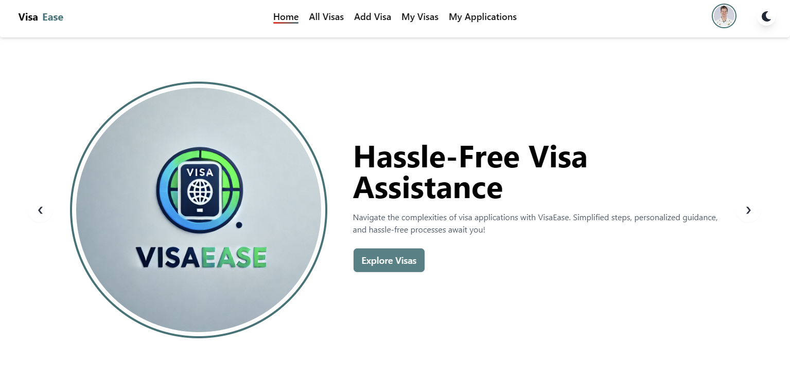

### Login Page

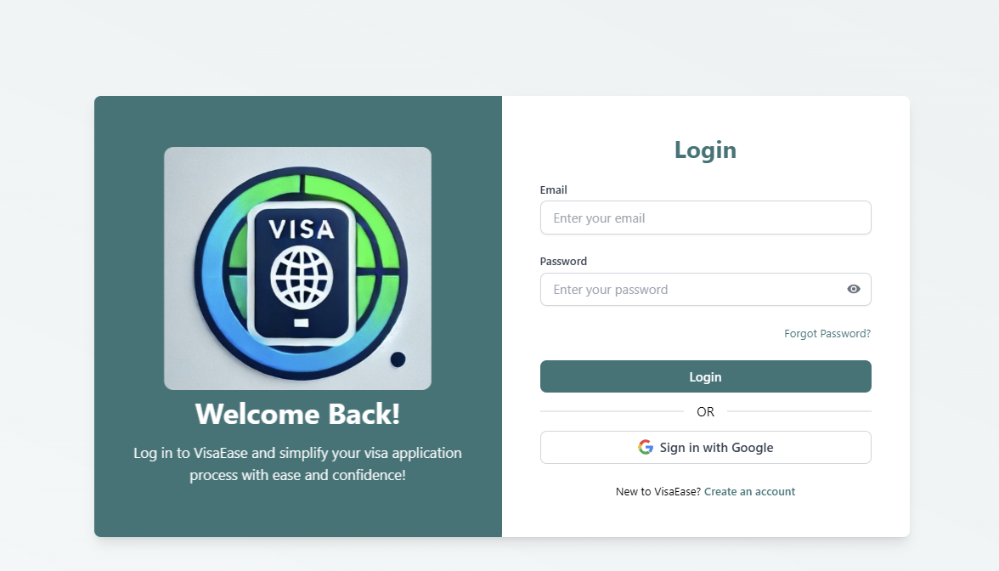

### SignUp Page

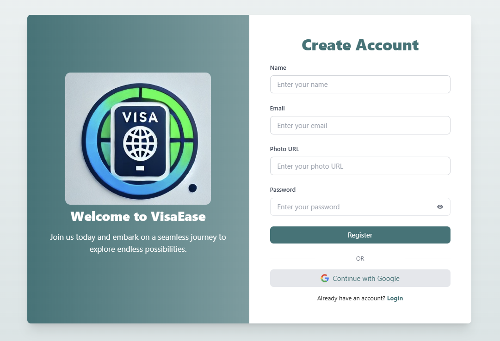

### Latest Visa Section

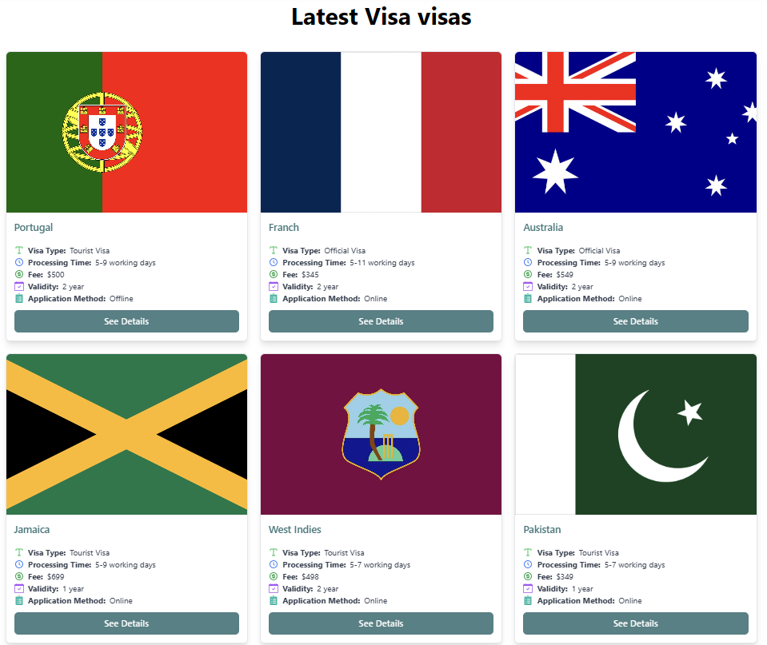

### Best Destinations and Airplane Section

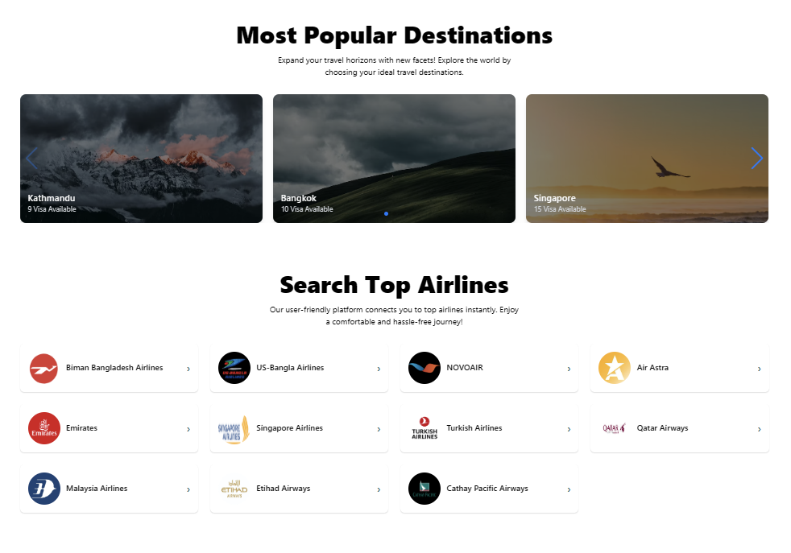

### All Visa Page

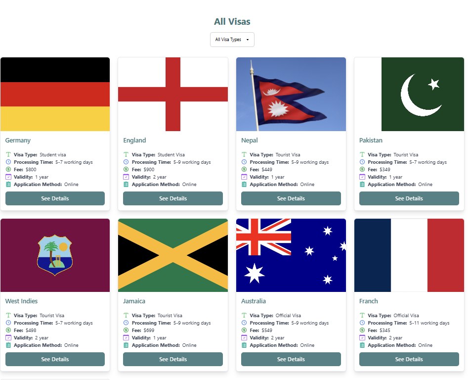

### Visa Details Page

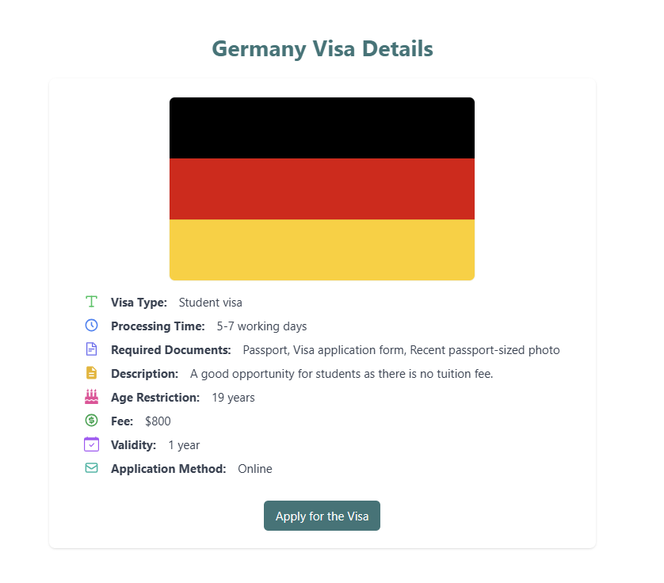

### Visa Application Form

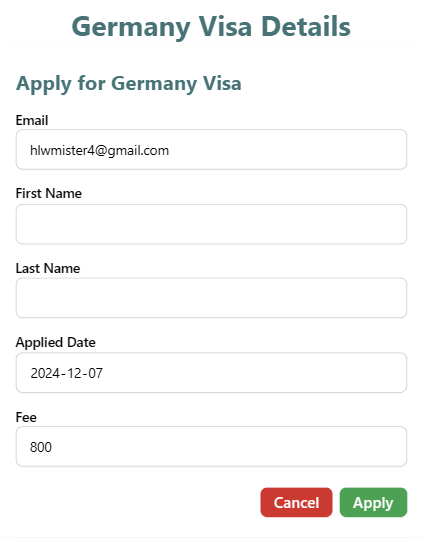

### Visa Details Update Form

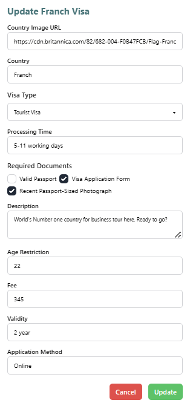

### Sweet Alert To Confirm Delete

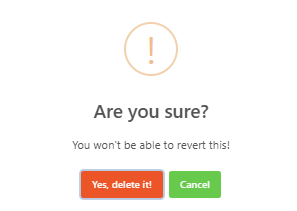

### Add Visa Page

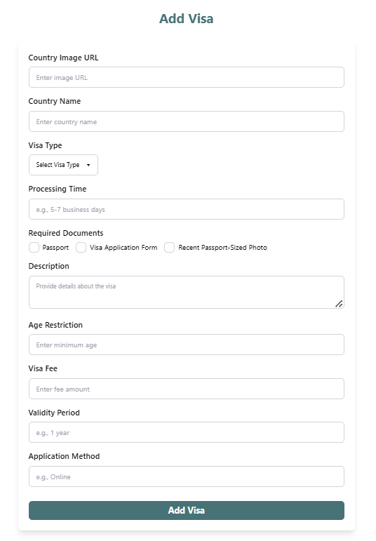

### My Added Visa Page

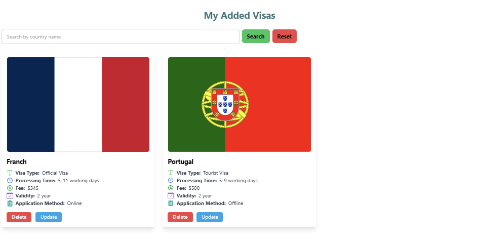

### My Visa Application Page

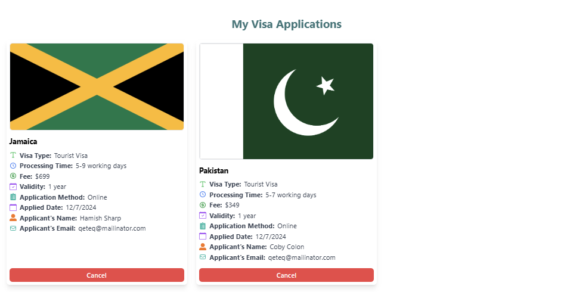

---

## Contributing

Contributions are welcome! If you'd like to contribute to VisaEase, please follow these steps:

1. Fork the repository.
2. Create a new branch (`git checkout -b feature-name`).
3. Make your changes and commit them (`git commit -m 'Add new feature'`).
4. Push your branch to your forked repository (`git push origin feature-name`).
5. Create a pull request.

---

Built with 💙 by [Sarafat Karim](https://www.linkedin.com/in/sarafat-karim/)
